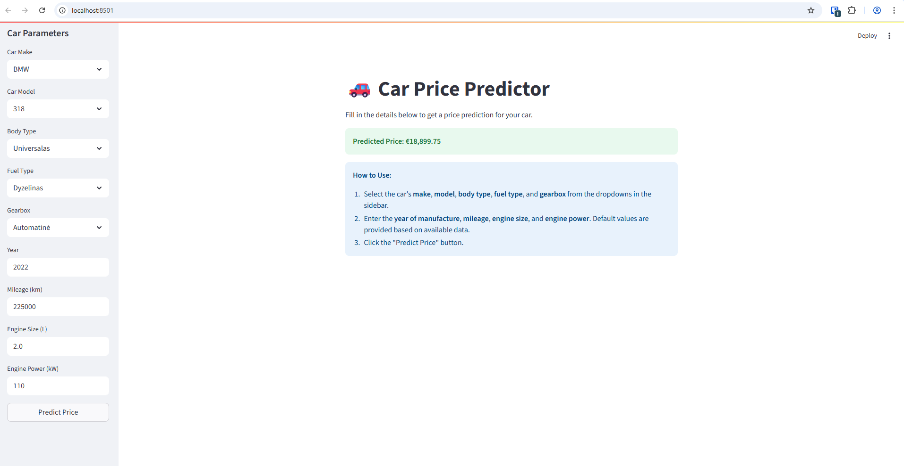

# Car Price Predictor
A Python project for web scraping car data, building machine learning models, and predicting car prices via a Streamlit UI.

## Project Overview
This project demonstrates an end-to-end machine learning pipeline: from collecting car data via web scraping, storing it in a database, training a predictive model, and finally, deploying a user-friendly interface for price prediction.

## Features
* **Automated Data Collection:** Scrapes car listings from a website.
* **Data Management:** Stores collected data efficiently in a local database.
* **Machine Learning Model:** Trains a model to accurately predict car prices.
* **Model Evaluation:** Provides insights into model performance.
* **Interactive UI:** Predict car prices easily through a web interface.

# Key Technologies Used
* **Python:** The core language powering the entire project.
* **pandas & numpy:** For efficient data cleaning, manipulation, and numerical operations on the car data.
* **BeautifulSoup4 & selenium:** Utilized for robust web scraping of car data from online sources.
* **SQLite:** For managing database interactions and storing scraped car data in a lightweight SQLite database.
* **scikit-learn & joblib:** Used for building and evaluating the machine learning model, with joblib specifically for saving and loading the trained model.
* **streamlit:** The framework chosen to create the interactive web user interface for price prediction.
* **logging:** Integrated for effective application monitoring and debugging.

# Setup and Run Instructions
Follow these simple steps to get the project running on your local machine:

**1. Clone the Repository:**
```bash
git clone https://github.com/karolisket/car-price-predictor
cd car-price-predictor
```

**2. Create a Virtual Environment (Recommended):**
```bash
python -m venv venv
# On Windows:
.\venv\Scripts\activate
# On macOS/Linux:
source venv/bin/activate
```

**3. Install Dependencies:**
```bash
pip install -r requirements.txt
```

**4. Initialize the Database:**
This step sets up the local database required for the project.
```bash
python sql_install.py
```

**5. Scrape Car Data:**

This will fetch car data from a website and populate your database.

*Note: This process might take some time depending on the amount of data to scrape.*
```bash
python web_scrapper.py
```

**6. Train the Machine Learning Model:**

This will train the car price prediction model and save it locally.
```bash
python train_and_save_model.py
```

**7. (Optional) Evaluate the Model:**

You can check the model's performance metrics here.
```bash
python evaluate_model.py
```

**8. Run the Price Prediction UI:**

Finally, launch the interactive Streamlit application to predict prices.
```bash
streamlit run streamlit.py
```
Once the command runs, your default web browser will open, showing the "Car Price Predictor" application.

# Example

Here you can see an example with filled data and predicted price.
